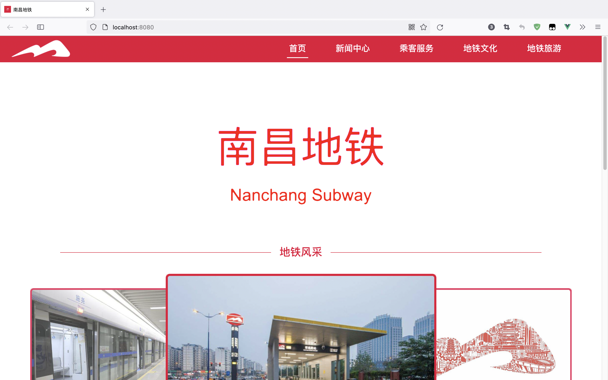

# 基于vue-cli的南昌地铁网站搭建



## 从github下载项目后，执行下面的命令导入依赖
```
npm install
```

### 运行命令
```
npm run serve
```

### 打包命令
```
npm run build
```


参考链接：  
[CSS3/SVG clip-path路径剪裁遮罩](https://www.zhangxinxu.com/wordpress/2014/12/css3-svg-clip-path/)  
[vue-axios|axios中文网](http://axios-js.com/zh-cn/docs/vue-axios.html)  
[nodejs express搭建服务器](https://blog.csdn.net/qq_37790252/article/details/99290881)  
[巧用滤镜实现高级感拉满的文字快闪切换效果](https://github.com/chokcoco/iCSS/issues/149)  
[西安地铁官网](https://www.xianrail.com/#/index)  
[把HTML告诉你的服务器cheerio](https://github.com/cheeriojs/cheerio/wiki/Chinese-README)  
[http-proxy-middleware项目](https://github.com/chimurai/http-proxy-middleware)  
[http-proxy-middleware使用方法和实现原理（源码解读)](https://www.cnblogs.com/zhaoweikai/p/9969282.html)  
[南昌地铁wiki百科](https://zh.wikipedia.org/wiki/南昌地铁)
[文化江西之南昌十大名小吃](http://www.360doc.com/content/20/0428/07/15294959_908836270.shtml)  
[2015 南昌·地铁海报赛（打酱油）](https://www.zcool.com.cn/work/ZMTM5NTE3MzY=.html)  
[南昌地铁运营时间](http://nc.bendibao.com/ditie/time.shtml)  
[metroflow](https://github.com/bartromgens/metroflow)
